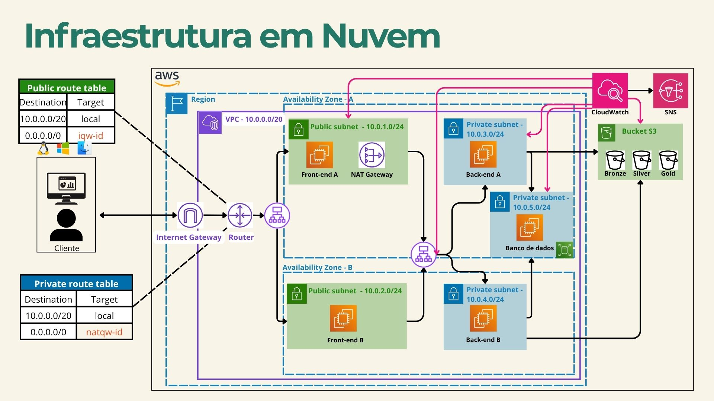

# ☁️ Família Connect — Infraestrutura AWS

> Scripts de provisionamento automatizado da infraestrutura em nuvem do sistema Família Connect, utilizando AWS CLI com alta disponibilidade em múltiplas zonas de disponibilidade.

---

## 📋 Sobre o Projeto

Este repositório contém os scripts Shell que provisionam toda a infraestrutura AWS do **Família Connect** de forma automatizada. A infraestrutura foi projetada com foco em **alta disponibilidade**, **segurança em camadas** e **observabilidade**, distribuindo os serviços em duas Availability Zones (A e B) dentro de uma VPC dedicada.

---

## 🗺️ Diagrama da Infraestrutura



---

## 🏗️ Visão Geral da Arquitetura

A infraestrutura é organizada em três camadas de sub-redes dentro de uma VPC (`10.0.0.0/20`) na região `us-east-1`:

| Camada | Sub-rede | Zona | CIDR | Descrição |
|---|---|---|---|---|
| Pública | sub-rede-publica-A | us-east-1a | 10.0.1.0/24 | Front-end A + NAT Gateway |
| Pública | sub-rede-publica-B | us-east-1b | 10.0.2.0/24 | Front-end B |
| Privada (Back) | sub-rede-back-A | us-east-1a | 10.0.3.0/24 | Back-end A |
| Privada (Back) | sub-rede-back-B | us-east-1b | 10.0.4.0/24 | Back-end B |
| Privada (DB) | sub-rede-db-A | us-east-1a | 10.0.5.0/24 | Banco de Dados |

### Roteamento

**Public Route Table** — usada pelas sub-redes públicas:
| Destination | Target |
|---|---|
| 10.0.0.0/20 | local |
| 0.0.0.0/0 | igw-id |

**Private Route Table** — usada pelas sub-redes privadas de back-end e banco:
| Destination | Target |
|---|---|
| 10.0.0.0/20 | local |
| 0.0.0.0/0 | natgw-id |

---

## 🛠️ Serviços AWS Utilizados

| Serviço | Finalidade |
|---|---|
| **VPC** | Rede virtual isolada (`10.0.0.0/20`) |
| **EC2 (t3.micro)** | 5 instâncias: 2 Front-end, 2 Back-end, 1 Banco de Dados |
| **Internet Gateway** | Acesso à internet para sub-redes públicas |
| **NAT Gateway** | Saída à internet para sub-redes privadas |
| **Application Load Balancer** | LB externo (Front) e interno (Back) |
| **ACL de Rede** | Controle de tráfego por camada (pública, back, DB) |
| **Security Groups** | Firewall por instância (front-sg, back-sg, db-sg) |
| **S3** | 3 buckets de armazenamento: Bronze, Silver e Gold |
| **CloudWatch** | Alarmes de CPU, rede, disco, LB e S3 |
| **SNS** | Notificações por e-mail dos alarmes CloudWatch |
| **Elastic IP** | IPs fixos para instâncias Front-end públicas |

---

## 📁 Estrutura do Repositório

```
Familia-Connect-Infra/
├── config_infra.sh      # Script principal: VPC, sub-redes, SGs, ACLs, EC2, LB, S3, CloudWatch, SNS
├── config_front.sh      # User-data das instâncias Front-end
├── config_back.sh       # User-data das instâncias Back-end
├── config_db.sh         # User-data da instância de Banco de Dados
├── excluir_infra.sh     # Script para destruir toda a infraestrutura
├── docker-compose.yml   # Compose para uso local/auxiliar
└── diagrama-infraestrutura.jpg            # Diagrama da infraestrutura
```

---

## 📊 Monitoramento

O CloudWatch Dashboard `familia-connect-dashboard` monitora em tempo real:

- **CPU de todas as instâncias EC2** (alarme em > 80% por 2 períodos de 5 min)
- **Tráfego de rede (NetworkIn/Out)** das instâncias Front-end (alarme em > 100 MB)
- **Tempo de resposta** do Load Balancer do Back-end (alarme em > 2s)
- **Hosts saudáveis** no Target Group do Back-end (alarme se ≤ 1)
- **Uso de disco** da instância de Banco de Dados (alarme em > 85%)
- **Tamanho dos buckets S3** Bronze, Silver e Gold (alarme em > 5 GB)

Todos os alarmes enviam notificações via **SNS** para os e-mails cadastrados da equipe.

---

## ⚙️ Pré-requisitos

Antes de executar os scripts, certifique-se de ter:

- [AWS CLI](https://aws.amazon.com/cli/) instalado e configurado (`aws configure`)
- Permissões IAM suficientes para criar VPC, EC2, ELB, S3, CloudWatch e SNS
- Bash disponível (Linux/macOS ou WSL no Windows)
- Chave de acesso AWS ativa no ambiente

---

## 🚀 Como Provisionar a Infraestrutura

### 1. Clone o repositório

```bash
git clone https://github.com/fsFernando072/Familia-Connect-Infra.git
cd Familia-Connect-Infra
```

### 2. Dê permissão de execução aos scripts

```bash
chmod +x config_infra.sh config_front.sh config_back.sh config_db.sh excluir_infra.sh
```

### 3. Configure suas credenciais AWS

```bash
aws configure
```

Informe: `AWS Access Key ID`, `Secret Access Key`, região (`us-east-1`) e formato de saída (`json`).

### 4. Execute o script principal

```bash
./config_infra.sh
```

O script irá provisionar, na ordem:

1. Par de chaves SSH (`myssh.pem`)
2. VPC e sub-redes (pública A/B, back A/B, DB A)
3. Internet Gateway e Route Table pública
4. NAT Gateway e Route Table privada
5. ACLs de rede (pública, back, DB)
6. Security Groups (front-sg, back-sg, db-sg)
7. Instâncias EC2 (2 front, 2 back, 1 DB)
8. IPs Elásticos para instâncias públicas
9. Load Balancers (externo para front, interno para back)
10. Buckets S3 (Bronze, Silver, Gold)
11. Tópico SNS e inscrições de e-mail
12. Alarmes e Dashboard no CloudWatch

---

## 🗑️ Como Destruir a Infraestrutura

Para remover todos os recursos provisionados e evitar cobranças:

```bash
./excluir_infra.sh
```

> ⚠️ **Atenção:** essa operação é irreversível. Todos os dados nas instâncias e buckets S3 serão perdidos.

---

## 🔒 Regras de Segurança

### Security Groups

| SG | Porta | Origem | Finalidade |
|---|---|---|---|
| front-sg | 22, 80, 443, 8080, 3333 | 0.0.0.0/0 | Acesso público ao Front |
| back-sg | 22, 443 | 0.0.0.0/0 | Gerenciamento |
| back-sg | 8080 | front-sg | Comunicação Front → Back |
| db-sg | 22 | 0.0.0.0/0 | Gerenciamento |
| db-sg | 3306 | back-sg | Acesso MySQL do Back |

---

## 📄 Licença

Este projeto está sob a licença MIT. Consulte o arquivo [LICENSE](LICENSE) para mais detalhes.